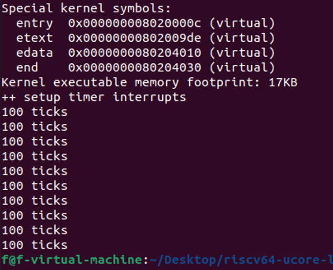

# Lab1: 断, 都可以断
## 2113615 张铭徐 2113203付政烨 2112241张惠程

## 练习 1：理解内核启动中的程序入口操作
阅读 kern/init/entry.S 内容代码，结合操作系统内核启动流程，说明指令 la sp, bootstacktop 完成了什么操作，目的是什么？tail kern_init 完成了什么操作，目的是什么？
## Answer:
### `la sp, bootstacktop` 的理解
在操作系统内核启动流程中，指令 `la sp, bootstacktop` 完成了以下操作：

1. **加载地址到寄存器**：指令 `la` 的目的是将一个地址加载到指定的寄存器中。在这里，`la sp, bootstacktop` 将 `bootstacktop` 的地址加载到栈指针寄存器 `$sp` 中。

2. **设置栈指针**：栈指针 (`$sp`) 是用来指向当前调用堆栈的顶部的寄存器。通过将 `bootstacktop` 的地址加载到 `$sp` 中，它将被设置为指向 `bootstacktop` 所代表的内存地址。

这个操作的目的是将OpenSBI模拟出来的物理内存地址赋值给栈指针 (`$sp`)。栈指针在操作系统中用于管理函数调用堆栈，确保函数的局部变量和返回地址正确地存储和检索。通过将 `$sp` 设置为 `bootstacktop`，操作系统内核可以开始使用 `bootstack` 作为函数调用堆栈的底部，从而支持函数的执行和任务切换等操作。

### `tail kern_init` 的理解
`tail kern_init` 的目的是进行尾调用，具体来说，是将控制权传递给名为 `kern_init` 的函数，而不保存当前函数 `kern_entry` 的返回地址。（尾调用是一种特殊的函数调用，它在调用函数之后不需要返回到调用它的函数，而是直接跳转到被调用函数的起始地址。这种技术通常用于函数优化，特别是在递归函数中，可以避免不必要的函数调用堆栈的积累，从而减少内存消耗和提高执行效率。）

`kern_entry` 是内核的启动点，而 `kern_init` 是内核初始化的入口函数。通过使用 `tail kern_init`，代码直接跳转到了初始化函数，这样可以将执行流程无缝地传递给内核初始化过程，而不会在每次函数调用之间保留额外的调用堆栈帧。这有助于减少内存使用，提高执行效率。

## 练习 2：完善中断处理（需要编程）
请编程完善 trap.c 中的中断处理函数 trap，在对时钟中断进行处理的部分填写 kern/trap/trap.c 函数中处理时钟中断的部分，使操作系统每遇到 100 次时钟中断后，调用 print_ticks 子程序，向屏幕上打印一行文字“100 ticks”，在打印完 10 行后调用 sbi.h 中的 shut_down() 函数关机。


要求完成问题 1 提出的相关函数实现，提交改进后的源代码包（可以编译执行），并在实验报告中简要说明
实现过程和定时器中断中断处理的流程。实现要求的部分代码后，运行整个系统，大约每 1 秒会输出一次”
100 ticks”，输出 10 行。
## Answer:
- 改写`interrupt_handler`函数
```
void interrupt_handler(struct trapframe *tf) {
    intptr_t cause = (tf->cause << 1) >> 1;
    switch (cause) {
        case IRQ_S_TIMER:
            // 处理时钟中断
            clock_set_next_event(); // 设置下次时钟中断
            interrupt_count++; // 增加中断次数
            // 检查是否达到100次时钟中断
            if (interrupt_count >= 100) {
                cprintf("100 ticks\n");
                printed_lines++;
                interrupt_count = 0; // 重置中断计数
                // 检查是否已经打印了10行
                if (printed_lines >= 10) {
                    // 调用关机函数
                    sbi_shutdown();
                }
            }
            break;
        // 其他中断类型的处理...
        // ...
    }
}
```
- 改写`print_ticks`函数
```
#define TICK_NUM 100

volatile size_t num = 0;
volatile size_t interrupt_count = 0;
volatile size_t printed_lines = 0;

static void print_ticks() {
    cprintf("%d ticks\n", TICK_NUM);
    printed_lines++;
    interrupt_count = 0; // 重置中断计数
    // 检查是否已经打印了10行
    if (printed_lines >= 10) {
        // 调用关机函数
        sbi_shutdown();
    }
}
```
- 执行：`make qemu`，查看结果




## Challenge1：描述与理解中断流程
描述 ucore 中处理中断异常的流程（从异常的产生开始），其中 mov a0，sp 的目的是什么？SAVE_ALL中寄寄存器保存在栈中的位置是什么确定的？对于任何中断，__alltraps 中都需要保存所有寄存器吗？请说明理由。
## Answer:
### 处理中断和异常的流程：
在`trapentry.S`中，处理中断和异常的流程如下：

1. 异常产生：
   - 中断异常是由于某种事件（例如外部硬件触发的事件，例如时钟中断或外部设备输入）而引发的。当这样的事件发生时，处理器会产生一个异常。

2. 进入异常处理程序：
   - 异常首先引发处理器进入异常处理程序。在这段代码中，异常处理程序的入口点是 `__alltraps` 标签。

3. 保存当前状态：
   - 异常处理程序开始时，首先调用 `SAVE_ALL` 宏，它的目的是保存当前的处理器状态。这包括保存通用寄存器（`x0`到`x31`）的值、状态寄存器（`s0`到`s4`）的值以及栈指针（`sp`）的值。（其中，四个寄存器的作用分别为：`sstatus`——保存当前CPU的状态；`sepc`——保存触发中断or异常的指令地址；`sbadaddr`——出现一些地址相关异常时的异常地址；`scause`——存储异常or中断发生的原因 是一个错误代码。）

4. 调用异常处理函数：
   - 接下来，通过 `jal trap` 指令调`trap` 的异常处理函数。这个函数将会处理特定类型的异常，根据异常类型执行相应的操作。在 `trap` 函数中，可以访问保存的寄存器状态以及特殊系统寄存器，以便进行异常处理。

5. 处理异常：
   - 在 `trap` 函数中，针对中断异常，可以执行必要的操作。这可能包括处理中断请求，保存当前执行上下文，执行中断处理程序，或者根据中断类型执行其他操作。处理完成后，`trap` 函数可能会更新寄存器状态，以便在返回时将控制权恢复到正确的位置。

6. 恢复之前的状态：
   - 异常处理程序在处理完异常后，通过 `RESTORE_ALL` 宏恢复之前保存的处理器状态。这个过程包括恢复通用寄存器的值、特殊系统寄存器的值以及栈指针的值。但是，值得注意的是，`restore`部分中仅仅恢复了`sstatus`和`sepc`两个寄存器的值，对于第三个和第四个并没有恢复。这是因为当处理完中断过后，意味着该问题已经被解决，就不需要保存这部分的内容以及恢复这一部分的内容了。

7. 返回到用户模式：
   - 最后，通过 `sret` 指令，处理器返回到用户模式执行。这将控制权返回给之前被中断的程序，使其能够继续执行。

###  `mov a0, sp` 指令含义
`move a0, sp` 这条指令为了将当前的堆栈指针 (`sp`) 的值传递给 `trap` 函数作为参数。在 RISC-V 架构中，函数参数通常是通过一些特定的寄存器来传递的，其中 `a0` 到 `a6` 寄存器被用作函数参数寄存器。因此，将当前堆栈指针的值存储在 `a0` 寄存器中，实际上是为了在调用 `trap` 函数时将堆栈指针的值传递给该函数，以便该函数能够知道中断发生时的堆栈位置。异常处理函数通常需要访问中断发生时的上下文信息，例如堆栈状态，以便能够正确地处理异常情况。通过将堆栈指针传递给 `trap` 函数，可以确保在异常处理期间能够访问当前的堆栈状态。

### SAVE_ALL寄存器保存在栈中的位置确定
在 `SAVE_ALL` 宏中，寄存器的保存位置是通过以下方式确定的：

1. 宏开始时，将当前栈指针 (`sp`) 的值保存到 `sscratch` 寄存器中。这是为了在异常处理期间保存原始栈指针的值，以便在恢复时使用。

2. 然后，通过逐一保存通用寄存器（`x0` 到 `x31`）的值，将它们依次存储在栈上。每个寄存器都按照其编号乘以 `REGBYTES` 的偏移量来确定存储位置。例如，`x0` 存储在 `0*REGBYTES(sp)` 处，`x1` 存储在 `1*REGBYTES(sp)` 处，以此类推。这个偏移量乘以 `REGBYTES` 是为了确保每个寄存器之间的存储位置之间有足够的空间。

3. 接着，特殊的系统寄存器（`s0` 到 `s4`）的值也被存储在栈上，其位置也是通过乘以 `REGBYTES` 的方式来确定的。

综上所述，每个寄存器的保存位置都是根据其在通用寄存器集（`x0` 到 `x31`）和系统寄存器集（`s0` 到`s4`）中的编号来确定的，并且这些位置都相对于栈指针 (`sp`) 的当前值进行计算。这确保了在保存和恢复寄存器时，它们的值被正确地存储和读取，并且不会互相覆盖。

### __alltraps 的寄存器保存问题
`__alltraps` 需要保存所有寄存器，其目的是为了处理各种类型的异常，以确保在异常处理程序中能够访问所有的寄存器状态。

## Challenge2：理解上下文切换机制
在 `trapentry.S` 中汇编代码 `csrw sscratch, sp；csrrw s0, sscratch, x0` 实现了什么操作，目的是什么？`save all`里面保存了 `stval scause` 这些 `csr`，而在 `restore all` 里面却不还原它们？那这样 `store` 的意义何在呢？
## Answer
### `csrw sscratch, sp；csrrw s0, sscratch, x0` 的功能
csrw指令用于在RISC-V架构中对控制和状态寄存器进行写入操作。例如，指令`csrw sstatus, s1`表示将寄存器`s1`的值写入到状态寄存器`sstatus`中，类似于状态寄存器中的`move`操作。而指令`csrw sscratch, sp`将当前堆栈指针`sp`的值存储到`sscratch`寄存器中。需要注意的是，`sscratch`寄存器通常被用作临时寄存器，其主要目的是在中断发生时，为了保存内核的堆栈指针而创建的一个临时存储空间。

指令`csrrw s0, sscratch, x0`表示读取`sscratch`寄存器的值，并将其写入到寄存器`s0`中，同时将寄存器`x0`的值写入原本的`sscratch`寄存器中。由于寄存器`x0`通常被称为零寄存器，因此这条指令的效果是将原本`sscratch`寄存器的值存储到寄存器`x0`中，并将`sscratch`寄存器的值设置为零。这一步操作在上下文中用于更好地服务于异常处理程序。

如果在这之后再次发生异常或中断，`sscratch`寄存器的值为零，而原本的`sscratch`寄存器的值存储在寄存器`s0`中，没有丢失信息。如果出现递归中断或异常情况，通过检查`sscratch`寄存器的值，可以确定是否来源于内核。在`csrr`指令之后，后续的`STORE`指令将保存在寄存器`s0`到`s4`中的值存储在内存中，以确保在异常处理过程中这些值不会被覆盖，并且可以在处理完成后进行恢复。这个过程有助于维护异常处理程序的正确执行以及保存关键的上下文信息。

###  `restore all` 中的寄存器维护问题
在上述代码的`RESTORE_ALL`部分，只有`sstatus`和`sepc`两个寄存器的值被恢复，而`scause`和`sbadaddr`的值没有被还原。这是因为`scause`寄存器存储了异常发生的原因，而`sbadaddr`寄存器存储了某些异常相关的地址。一旦异常或中断处理完成，就不再需要保留这些信息了。所以，这段代码选择只恢复必要的寄存器，而忽略了`scause`和`sbadaddr`寄存器的值。这样可以有效地管理寄存器状态，并确保异常处理后程序的继续执行。

## Challenge3：完善异常中断
编程完善在触发一条非法指令异常 mret 和，在 kern/trap/trap.c 的异常处理函数中捕获，并对其进行处理，简单输出异常类型和异常指令触发地址，即“Illegal instruction caught at 0x(地址)”，“ebreak caught at 0x（地址）”与“Exception type:Illegal instruction”，“Exception type: breakpoint”。
## Answer
- 改写`exception_handler`函数
```
void exception_handler(struct trapframe *tf) {
    switch (tf->cause) {
        case CAUSE_ILLEGAL_INSTRUCTION:
            // 非法指令异常处理
            cprintf("Illegal instruction caught at 0x%x\n", tf->epc);
            cprintf("Exception type: Illegal instruction\n");
            // 更新 epc 寄存器，跳到下一条指令
            tf->epc += 4;
            break;
        case CAUSE_BREAKPOINT:
            // 断点异常处理
            cprintf("ebreak caught at 0x%x\n", tf->epc);
            cprintf("Exception type: breakpoint\n");
            // 更新 epc 寄存器，跳到下一条指令
            tf->epc += 4;
            break;
        // 其他中断类型的处理...
        // ...
    }
}
```
- 改写`clock.`c文件（触发异常）
```
void clock_init(void) {
    set_csr(sie, MIP_STIP);
    clock_set_next_event();
    ticks = 0;
    cprintf("++ 设置定时器中断\n");

    //__asm__ volatile("ebreak"); // 插入一个ebreak指令以生成断点异常
    __asm__ volatile(".word 0xFFFFFFFF"); // 使用无效的操作码生成非法指令

    // 插入一个mret指令以从机器态返回到先前的模式
    __asm__ volatile("mret");
}
```

需要注意的是，RISC-V体系结构中，异常处理时，`tf->epc`寄存器会自动保存异常发生的地址。在输出异常错误地址时，不应该使用`badvaddr`寄存器的值，因为`badvaddr`寄存器仅在页面错误或某些其他内存异常情况下存储相关指令的地址。对于指令异常，`badvaddr`寄存器不会存储相关信息。

- 实验结果


